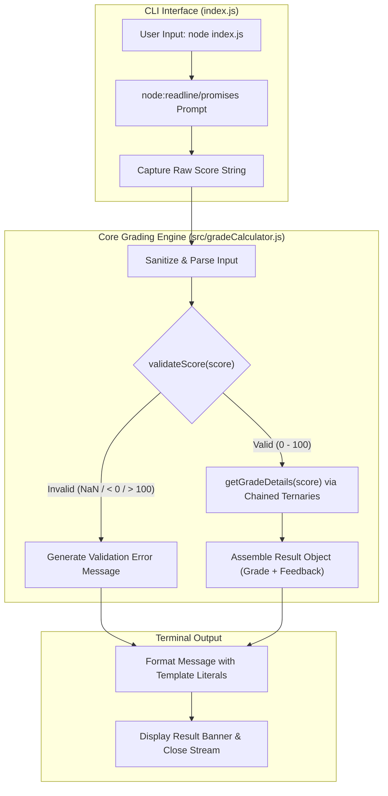

# 🎓 Grade Calculator CLI

[](https://nodejs.org/)
[](LICENSE)
[](#security-audit)
[](#es6-design-standards)
[](#running-tests)

A lightweight, robust, interactive Command Line Interface (CLI) Grade Calculator built with **Node.js** and designed exclusively around **ES6 fundamentals**.

### 🛠️ Tech Stack

[](https://nodejs.org/)
[](https://developer.mozilla.org/en-US/docs/Web/JavaScript)
[](https://www.npmjs.com/)
[](https://github.com/features/actions)

---

## ✨ Features

- ⚡ **Zero External Dependencies**: Powered purely by native Node.js standard libraries (`node:readline/promises`, `node:test`, `node:assert/strict`).
- 🎯 **Strict Input Validation**: Safely handles numeric scores, whitespace, empty values, decimal scores, and edge bounds (`0` to `100`).
- 💬 **Dynamic Feedback**: Computes letter grades and returns constructive performance commentary.
- 🧪 **Comprehensive Automated Tests**: 100% test coverage over boundary edges, edge cases, and invalid inputs using Node's native test runner.
- 🛡️ **Zero Security Vulnerabilities**: Clean security audit with zero supply chain attack surface.

---

## 📊 Grading Scale

| Score Range | Grade | Performance Feedback |
| :--- | :---: | :--- |
| **90.0 – 100.0** | **A** | *Outstanding performance!* |
| **80.0 – 89.9** | **B** | *Great job!* |
| **70.0 – 79.9** | **C** | *Good effort, room for improvement.* |
| **60.0 – 69.9** | **D** | *Needs improvement to meet passing standards.* |
| **0.0 – 59.9** | **F** | *Failing grade. Significant improvement required.* |
| *Out of Range / Non-numeric* | **N/A** | *Validation error message prompting for range 0–100.* |

---

## 🏗️ Architecture



---

## 📐 ES6 Design Standards

This project adheres strictly to modern ES6+ coding conventions:
- **Block Scope**: `const` and `let` enforce block scoping throughout the codebase with no `var` usage.
- **Arrow Functions**: All methods, functions, and test suites are defined as arrow functions.
- **Template Literals**: All string concatenations, outputs, and CLI banners employ template literals (`` `${...}` ``).
- **Ternary Operators**: All conditional logic and evaluation branches are structured through clean ternary expressions.
- **ES Modules**: Modern `import`/`export` syntax enabled via `"type": "module"` in `package.json`.

---

## 🚀 Getting Started

### Prerequisites

- [Node.js](https://nodejs.org/) version **18.0.0** or higher (tested on Node 20, 22, and 24).

### Installation

Clone the repository:
```bash
git clone https://github.com/<your-username>/Grade-Calculator-CLI.git
cd Grade-Calculator-CLI
```

Install/verify dependencies:
```bash
npm install
```

---

## 💻 Usage

### Interactive Mode

Run the application:
```bash
npm start
```
*Or directly via Node:*
```bash
node index.js
```

**Example Session:**
```text
Enter student score (0-100): 85.5

=== Grade Evaluation ===
Score: 85.5 | Grade: B - Great job!
```

### Piping Input (Non-Interactive / Scripting)

You can also pass scores via standard input:
```bash
echo 94 | node index.js
```

---

## 🧪 Running Tests

The project uses Node.js's built-in test runner (`node:test`):

```bash
npm test
```

**Output:**
```text
✔ validateScore should validate numeric ranges correctly
✔ getGradeDetails should assign correct grades and feedback
✔ evaluateScore should handle valid string input and parse correctly
✔ evaluateScore should reject invalid input gracefully
ℹ tests 4
ℹ pass 4
ℹ fail 0
```

---

## 📂 Project Structure

```text
Grade-Calculator-CLI/
├── .github/
│   └── workflows/
│       └── ci.yml             # GitHub Actions CI workflow (Node 20, 22)
├── src/
│   └── gradeCalculator.js     # Core grade evaluation and validation logic
├── test/
│   └── gradeCalculator.test.js# Automated unit tests using node:test
├── .gitignore                 # Files and directories ignored by Git
├── index.js                   # CLI entry point using readline/promises
├── LICENSE                    # ISC License
├── package.json               # Project manifest, scripts, and engine config
├── README.md                  # Project documentation
└── SECURITY.md                # Security policy and zero-dependency audit report
```

---

## 🔒 Security Audit

A full security audit was conducted:
- **`npm audit`**: 0 vulnerabilities found.
- **Third-party packages**: 0 external packages.
- Details and security policies are documented in [SECURITY.md](SECURITY.md).

---

## 📄 License

This project is licensed under the [ISC License](LICENSE).
